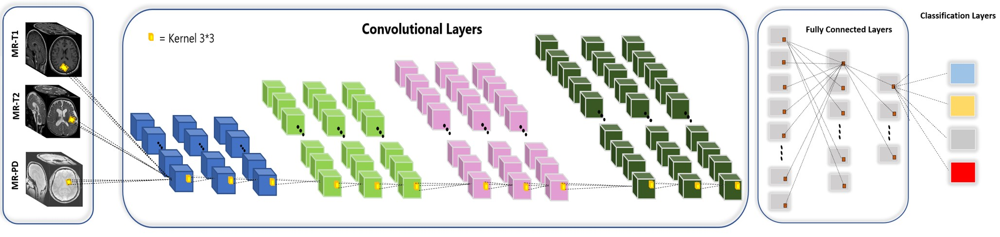
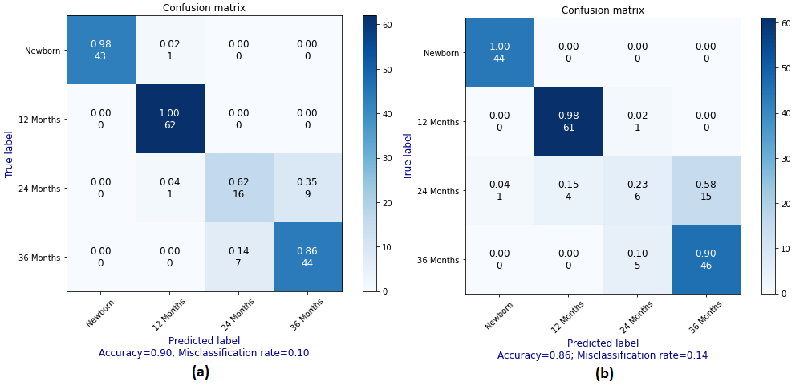

# 2D-CNN & 2.5D-CNN & 3D-CNN_MRI-Classification
2D CNN and 3D CNN models for MRI multi-classification using 5fold cross validation.
On the task of classifying infants into age groups based on T1w, T2w, and PD images, several architectures of 2D and 3D CNN were explored and compared to Transfer Learning using ResNet50 and Inception, among others.

The dataset consists of 89 patients, out of which several had more than one image taken in one or more ages. All images are NIfTI

# Please cite to this paper:
## SPIE 2022 Medical Imaging
Shabanian, Mahdieh, Markus Wenzel, and John P. DeVincenzo. "Infant Brain Age Classification: 2D CNN Outperforms 3D CNN in Small Dataset." arXiv preprint arXiv:2112.13811 (2021).

3D CNN architecture for early fusion

Confusion matrices for (a) 2D, (b) 3D fusion CNN

